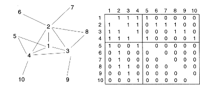

```{r setup, include=FALSE}
knitr::opts_chunk$set(
  echo = TRUE,
  comment = "##",
  collapse = TRUE
  )
```

<!-- <div style="text-align: justify"> -->

# Introducción

## Historia del análisis de redes sociales

- A continuación, presentamos una breve evolución histórica del análisis de redes sociales. Para ello, veremos de forma sintética algunos trabajos fundamentales sobre la materia.
- Este repaso histórico se basa en el capítulo “Evolución histórica del análisis de redes sociales” de Galaso (2011), disponible en:
  - Galaso, P. (2011). Capital social y desarrollo económico un estudio de las redes de innovación en España, Tesis doctoral, Universidad Autónoma de Madrid. <https://repositorio.uam.es/bitstream/handle/10486/6639/39410_Galaso_reca_pablo.pdf>
- Para una descripción más detallada de la historia del análisis de redes sociales, se pueden consultar también los trabajos de Barabasi (2002), Watts (2006), De Ugarte (2007) o Freeman (2012).
- Advertencia: algunos de los puntos que se presentan en esta historia se retomarán y estudiarán en mayor profundidad posteriormente, en la sección sobre modelos de redes.

### Euler y los siete puentes de Königsberg

- Algunos autores identifican el origen del análisis de redes sociales con el nacimiento de la teoría de grafos como rama de las ciencias matemáticas en 1736, cuando el célebre matemático suizo Leonhard Euler resolvió un antiguo acertijo conocido como el problema de los siete puentes de Königsberg. 
- El acertijo: el río Pregolya cruzaba la ciudad de Köningsberg (actualmente Kaliningrado, en Rusia) dejando dos islas en el centro; las distintas partes de tierra firme estaban unidas por siete puentes. El acertijo local planteaba: ¿cómo se puede recorrer Köningsberg cruzando cada uno de sus siete puentes una sola vez?


- REFERENCIA: Euler, L. (1741). Solutio problematis ad geometriam situs pertinentis. Commentarii academiae scientiarum Petropolitanae, 128-140. https://scholarlycommons.pacific.edu/cgi/viewcontent.cgi?article=1052&context=euler-works 
- Para resolver este problema, Euler construyó un grafo o red donde los nodos simbolizaban las distintas partes de tierra firme y las líneas representaban los puentes. El resultado es un grafo de cuatro nodos y siete líneas como el del siguiente gráfico.


- Sobre esta base, Euler demostró que era imposible dar el paseo que planteaba el acertijo. El razonamiento fue el siguiente: si tenemos en cuenta que los nodos con un número impar de líneas únicamente pueden ser el comienzo o el final del recorrido, entontes el número de nodos con líneas impares no puede ser en ningún caso mayor que dos. Dado que la red de puentes de Köningsberg hay cuatro nodos con un número impar de líneas, el recorrido planteado por el acertijo es imposible.
- Lo que Euler logró con este razonamiento, además de resolver un acertijo matemático a través de una demostración sencilla, fue aportar una nueva perspectiva de análisis a la hora de afrontar un problema. Euler fue capaz de ver los puentes de Königsberg sobre el Pregolya como una pequeña red de cuatro nodos y siete líneas. Y, al dibujarla, hizo evidente una de las múltiples propiedades matemáticas que las redes tienen en su estructura.
- Conocer las redes y sus propiedades intrínsecas supone un importante punto de partida para la comprensión de una gran variedad de problemas complejos. En los años siguientes a la publicación de los trabajos iniciales de Euler sobre grafos, aparecieron numerosos estudios acerca de la estructura y las propiedades matemáticas de diferentes tipos de redes. Había nacido la teoría de redes.
- RECUADRO: Caminos, paseos y ciclos.
  - Camino: secuencia de nodos y vínculos en la que solo se pasa una vez por cada vínculo y cada nodo.
  - Paseo: secuencia de nodos y vínculos en la que, pasando una sola vez por cada vínculo, se puede pasar por un mismo nodo más de una vez. 
  - Ciclo: paseo que comienza y finaliza en el mismo nodo. 

### Los primeros sociogramas

- En los años treinta, los trabajos de Jacob Moreno y Helen Hall Jennings fueron pioneros en visualizar las relaciones entre los alumnos de un aula a través de una estructura de red.
- Su estudio “se basaba en intuiciones estructurales, implicaba la recopilación de datos empíricos sistemáticos, las imágenes gráficas eran una parte integral de sus herramientas y encarnaba un modelo matemático explícito. Esa perspectiva estructural, además, se generalizaba a una serie de fenómenos". (Freeman, 2004)
  - REFERENCIA: Moreno, J. L. (1934). Who shall survive?: A new approach to the problem of human interrelations. https://archive.org/details/whoshallsurviven00jlmo/mode/2up

### Las redes aleatoria

- La mayoría de los trabajos iniciales de teoría de grafos desarrollados desde las matemáticas se centraron en el análisis de redes regulares, que presentaban estructuras ordenadas y relativamente sencillas. Sin embargo, las redes del mundo real rara vez muestran estructuras de este tipo. 
- A finales de los años cincuenta, los matemáticos húngaros Paul Erdős y Alfréd Rényi se plantearon qué leyes rigen el proceso de formación de una red. Es decir, según qué criterios se van uniendo unos nodos con otros hasta formar una red. Dada la imposibilidad de encontrar un patrón de comportamiento común a todas las redes del mundo real, Erdős y Rényi optaron por eliminar deliberadamente el supuesto de existencia de un patrón y partieron de un supuesto de aleatoriedad. Es decir, consideraron que las conexiones entre nodos de una red se hacen de forma absolutamente aleatoria. En 1959 desarrollaron un elegante modelo matemático conocido como modelo de redes aleatorias (Erdős y Rényi, 1959). 
  - REFERENCIA: Erdős, P.; Rényi, A. (1959). "On Random Graphs. I.". Publicationes Mathematicae 6: 290–297
- Según este modelo, la formación de una red sigue el siguiente proceso: partiendo de un conjunto de N nodos desconectados, se van añadiendo líneas que interconecten los nodos de dos en dos aleatoriamente, cada nuevo vínculo unirá con igual probabilidad a dos nodos de la red independientemente de sus características, su posición en la red o el número de vínculos que ya tengan previamente. 
- Sobre esta base, Erdős y Rényi descubrieron una propiedad interesante relacionada con la cohesión o conectividad general de la red: a medida que el número de líneas (M) va aumentando, van apareciendo diferentes subgrupos o componentes de nodos cada vez más numerosos hasta que, cuando el número medio de líneas por nodo es igual a uno (es decir, cuando N = M) emerge un componente gigante de nodos que aglutina a la mayoría de ellos (véase Recuadro 1). Este proceso es comparable a lo que los físicos conocen como transición de fase. 
- Esto implica que cuando las conexiones son aleatorias, basta con que exista un promedio de una línea por nodo para que la mayoría de los nodos del grafo estén interconectados en un mismo componente. Un componente de una red es un conjunto de nodos en el que todos están directa o indirectamente conectados entre sí, pero desconectados del resto de nodos.
- Gracias al modelo de Erdős y Rényi, se descubrió una importante propiedad de las redes sociales: para toda red existe un número de líneas tal que, si nos situamos por debajo de él, predomina la desconexión entre sus actores, mientras que, al superarlo, la estructura cambia drásticamente al aparecer un componente gigante que aglutina a la mayoría de los nodos. Dicho de otra forma: los cambios estructurales en las redes sociales se producen habitualmente de forma escalonada, hasta un cierto punto a partir del cual la estructura cambia bruscamente.
- En la actualidad, el modelo de redes aleatorias se emplea como punto de partida y base teórica para la generación de otras redes; sin embargo, se ha demostrado que en la mayor parte de las redes reales la creación de vínculos entre nodos dista mucho de seguir el criterio de aleatoriedad absoluta y, por lo tanto, ni la estructura ni la evolución en el tiempo de las redes del mundo real se ajustan perfectamente al modelo de redes aleatorias. Para conocer las redes del mundo real, se deben, por tanto, replantear los supuestos del modelo.

### Los seis grados de separación

- A partir de 1967, el psicólogo social estadounidense Stanley Milgram llevó a cabo una serie de famosos experimentos cuyos resultados hicieron replantear la dirección de las investigaciones en análisis de redes sociales. Sus trabajos también dieron origen a una teoría que llegó a considerarse un mito de la cultura popular: la teoría de los seis grados de separación. 
- De acuerdo a esta teoría, todos los habitantes del planeta están conectados de forma que entre cualquier par de personas existen, como máximo, cinco intermediarios y, por tanto, seis enlaces. En otras palabras, si cada enlace entre dos personas es un grado de separación, toda la humanidad está conectada con un máximo de seis grados de separación entre sus miembros.
- En los experimentos de Milgram, llevados a cabo en la Universidad de Harvard, se trataba de analizar las redes sociales en Estados Unidos midiendo la distancia social que separaba a cada ciudadano del país. 
- Para ello, eligió a dos personas: una en la ciudad de Sharon y otra en Boston, ambas en el estado de Massachussets, y 160 personas en las ciudades de Wichita y Omaha, en los estados de Kansas y Nebraska respectivamente (en el interior del país, a miles de kilómetros de Massachussets). Las 160 personas de Wichita y Omaha recibieron una carta con información detallada del experimento. En ella se les explicaba que debían hacer llegar esa carta a una persona objetivo (una de las dos de Massachussets), sobre la que se incluía una fotografía, el nombre, la dirección y alguna información básica. Pero bajo una condición: la carta sólo se podía enviar directamente al objetivo en caso de que se le conociera personalmente, si no, se debía enviar a una persona conocida que tuviera más probabilidad de conocer al objetivo. De esta forma, las cartas iban pasando, de unas personas a otras, siempre entre conocidos, hasta llegar a la persona objetivo en Massachussets. Cuando una carta llegaba al final del proceso, se contaba el número de intermediarios para medir los grados de separación entre el origen y el final de la cadena.
- El resultado del experimento fue el siguiente: si bien no todas las cartas llegaron hasta la persona objetivo (sólo lo hicieron 42 de las 160), en las que sí llegaron, el número medio de intermediarios fue de 5,5. Es decir, en 42 de los 160 casos, existía una conexión entre los habitantes del interior y los de la costa este. Una conexión que, redondeando al alza, tenía seis grados de separación. 
- Aunque no se empleara un análisis de grafos ni se estudiaran sus propiedades matemáticas, los experimentos de Milgram supusieron un gran avance en el conocimiento de la estructura de las redes sociales. Vinieron a decir que no sólo es muy probable que todas las personas estemos conectadas en una misma gran red social, sino que lo estamos a pocos pasos de distancia unos de otros. Es decir, aunque la red social mundial tenga un número muy elevado de nodos, su diámetro es muy reducido. (El camino más corto entre un par de nodos se conoce como geodésica, y el diámetro de una red es la geodésica de mayor tamaño entre sus nodos). Esta propiedad de las redes se conoce como el fenómeno del mundo pequeño.
  - REFERENCIA: Milgram, S. (1967). The small world problem. Psychology today, 2(1), 60-67.

### Lazos fuertes y lazos débiles

- En 1973, el sociólogo estadounidense Mark Granovetter publicó un artículo acerca de la estructura de las relaciones sociales cuyas principales conclusiones parecían estar en contra del fenómeno del mundo pequeño mostrado por Milgram. 
- Partiendo del hecho de que los lazos interpersonales facilitan información de los individuos para el cambio de empleo, Granovetter estudió el uso de contactos personales para la búsqueda de empleo. En su trabajo distingue dos tipos de lazos utilizando como criterio para diferenciarlos la fuerza del lazo, o sea, una combinación de la cantidad de tiempo, intensidad emocional, intimidad, confianza mutua y servicios recíprocos que caracterizan la relación entre dos individuos (Granovetter, 1973).
- Según Granovetter, se pueden distinguir dos tipos de lazos: 
  - Lazo fuerte: conecta a personas cercanas, formando núcleos o aglomeraciones (clusters) de individuos entre los que se da una gran cantidad de lazos de este tipo. Normalmente estos lazos representan relaciones familiares o de amistad cercana. 
  - Lazo débil: pone en contacto a personas conocidas, pero menos cercanas. Estos lazos suelen identificarse con relaciones indirectas y en las que los encuentros se dan con menor regularidad. 
- Se realizaron 54 entrevistas a personas que encontraron trabajo a través de contactos sociales. Para medir la fortaleza de los lazos considera el número de interacciones . Lazo fuerte: al menos dos interacciones a la semana. Lazo medio: al menos una interacción al año. Lazo débil: menos de una interacción al año.
- Resultados: 16.7 % encuentran trabajo por medio de un lazo fuerte, 55.7 % por un lazo medio y 27.6 % por un lazo débil. Es decir, los lazos débiles son un mejor recurso para la búsqueda de empleo que los lazos fuertes (Granovetter, 1973). 
- Interpretación: los lazos débiles forman puentes y ponen en común información menos redundante
- Conclusiones: las personas unidas por lazos débiles se mueven en círculos más diversos, por lo que tienen acceso a información más variada. Además, la mayoría de quienes cambiaron de empleo utilizando información proporcionada por una relación interpersonal, recibieron esa información a través de lazos débiles. Por tanto, los lazos débiles son un mejor recurso para la búsqueda de empleo que los lazos fuertes. Por ello, el título de su artículo es The Strenght of Weak Ties, o sea, La fuerza de los lazos débiles.
- En la estructura social que plantea Granovetter –que se asemeja bastante a la de las redes del mundo real– los contactos están principalmente concentrados en un entorno cercano de las personas (familiares, amigos, vecinos, compañeros de trabajo, etc.). Esto genera agrupamientos (o clusters) de personas densamente conectados a través de lazos fuertes. Al mismo tiempo, algunos lazos débiles interconectan a personas de entornos diferentes, poniendo así en contacto a diferentes agrupamientos. 
- La pregunta que surge en este punto es la siguiente: ¿es compatible esta estructura social, derivada del trabajo de Granovetter, con el fenómeno del mundo pequeño que se infiere del trabajo de Milgram? 
  - REFERENCIA: Granovetter, M. S. (1973). The strength of weak ties. American journal of sociology, 78(6), 1360-1380.

### Las redes de mundo pequeño

- ¿Qué características estructurales le pueden permitir a una red fuertemente fragmentada en multitud de agrupamientos presentar la propiedad del mundo pequeño? Una pregunta como esta motivó a Duncan Watts y a Steven Strogatz a investigar acerca de lo que definen como las redes de mundo pequeño (Watts y Strogatz, 1998).
- Watts y Strogatz (1998) partieron de dos premisas simples:
  - Primero: las redes sociales del mundo real no son aleatorias, gran parte de los contactos entre las personas vienen condicionados por el entorno en el que se mueven.
  - Segundo: no obstante, algunos de los contactos sí se forman con cierta aleatoriedad.
- Los autores propusieron indicadores para medir dos características estructurales de las redes que buscan encontrar en sus redes: agrupamiento y distancia entre nodos.
  - Coeficiente de agrupamiento: en una red de amistad, el coeficiente de agrupamiento de un nodo (conocido como clustering coefficient) mide la proporción de sus amigos que a su vez son amigos entre sí. 
  - Longitud de camino: este indicador mide la distancia más corta a la que se encuentra cada nodo, en promedio, del resto de nodos de la red. 
- Watts y Strogatz elaboraron dos modelos opuestos de estructura de red según el nivel de aleatoriedad que mostraran en la formación de los vínculos. 
  - El primer modelo es un retículo periódico, es decir, una red absolutamente regular (sin aleatoriedad) ya que los contactos se hacen siempre de la misma forma: situando todos los nodos en una circunferencia, cada nodo establece vínculos con los cuatro que le rodean. Este grafo presenta niveles muy elevados tanto del coeficiente de agrupamiento, como de longitud de camino, la cual además crece linealmente cuando lo hace el número de nodos. 
  - En el otro extremo, sitúan a la red completamente aleatoria propuesta por Erdős y Rényi en la que cada nodo tiene igual probabilidad de establecer vínculos con cualquier otro nodo, sea o no de su entorno cercano. En esta última red, tanto el coeficiente de agrupamiento como la longitud de camino son muy bajos y, además, ésta aumenta sólo de forma logarítmica a medida que lo hace el número de nodos.
- Entre estos dos extremos, Watts y Strogatz situaron un tipo de red con cierto nivel de aleatoriedad. Al introducir aleatoriedad, observan que el coeficiente de agrupamiento se reduce lentamente, pero la longitud de camino disminuye drásticamente. Esto deja un amplio margen para un tipo de red con un bajo grado de separación entre sus nodos, pero a la vez altamente agrupada. Se trata de la red de mundo pequeño.
- En resumen, el modelo de Watts y Strogatz logra aunar los elevados niveles de agrupamiento propuestos por Granovetter con una reducida longitud de camino como la sugerida por Milgram
- Watts y Strogatz contrastan empíricamente el ajuste de este modelo con datos de redes del mundo real. En particular, observan que el modelo se ajusta bien a tres redes diferentes: la red de colaboración entre actores de Hollywood, la red eléctrica de Estados Unidos y la red neuronal del gusano Caenorhabditis elegans.
- A partir de estos resultados, los autores sugieren que el fenómeno del mundo pequeño no es una curiosidad que sucede únicamente en algunas redes sociales, sino más bien una característica estructural de multitud de grafos presentes en el mundo real.
  - REFERENCIA: Watts, D. J., & Strogatz, S. H. (1998). Collective dynamics of ‘small-world’networks. nature, 393(6684), 440-442.

### Las redes sin escala

- Muchas redes del mundo real tienen algunos nodos que aglutinan un gran número de vínculos. Estos nodos, conocidos como núcleos, conectores o hubs, no aparecen reflejados en el modelo de redes del mundo pequeño de Watts y Strogatz.
- Ante esto cabe plantearse ¿cómo surgen esos hubs? ¿cuántos se supone que debe haber en una red dada? ¿por qué los modelos previos no pudieron tenerlos en cuenta? (Barabasi, 2002).
- Para afrontar estas cuestiones, Barabasi y Albert (1999) analizaron la distribución del número de líneas por nodo –conocida como distribución de grado– en las redes aleatorias y en las de mundo pequeño.
  - REFERENCIA: Barabási, A. L., & Albert, R. (1999). Emergence of scaling in random networks. science, 286(5439), 509-512.
- Encontraron que, en ambos casos, se puede ajustar a una distribución normal. Es decir, que la mayoría de nodos en estas redes tienen un grado igual o muy similar al promedio, y raramente aparecen nodos con un grado muy superior o muy inferior a la media.
- Sin embargo, al estudiar la distribución de grado en redes del mundo real, los autores descubrieron que no se ajustaban a una distribución normal, sino que seguían más bien una ley potencial. O sea, que la mayor parte de los nodos tienen un grado bajo, mientras que un reducido grupo de nodos altamente conectados aglutinan la mayoría de los lazos manteniendo unida al conjunto de la red. Esto se puede observar en el siguiente gráfico.


- Tanto en las redes aleatorias como en las redes de mundo pequeño, la mayor parte de los nodos tienen un grado muy similar a la media, por lo que resulta extraño encontrarse con nodos de grado significativamente superior o inferior al resto, lo que implica que estos dos tipos de redes tienen una escala característica que se identifica con el nodo promedio y se fija por el pico de la distribución. En cambio, la ausencia de un pico en la distribución de la ley potencial implica que no existe ese nodo característico o nodo típico, por lo que no hay una escala intrínseca en esta red. Es por esto por lo que se conoce a este tipo de redes como redes libres de escala o redes sin escala (Barabasi, 2002).
- El modelo fue contrastado por Barabasi y Albert con los datos de algunas redes reales como la red de colaboración de actores de cine –igual que la analizada por Watts y Stogatz–, la red física de Internet, la estructura de enlace virtual de la World Wide Web y las redes metabólicas de algunos organismos. La conclusión fue igual para todos los casos: se trataba de redes sin escala. Por ello, los autores pueden afirmar que algunas redes reales parecen presentar las propiedades estructurales de las redes sin escala.

### Algunos aprendizajes de esta historia 

- Aunque la historia del análisis ha seguido avanzando sustancialmente desde los últimos modelos aquí presentados, este breve repaso nos sirve para extraer dos conclusiones. 
- Primero, el fuerte carácter interdisciplinar: el análisis de redes sociales ha surgido y experimentado avances desde múltiples ámbitos académicos, como las matemáticas, la psicología, la sociología o la física.
- Segundo, la diversidad de aplicaciones y su coincidencia en la complejidad: el análisis de redes sociales parece ser una herramienta potente para aproximarse a multitud de aspectos del mundo real: relaciones de amistad, vínculos laborales, infraestructuras, conexiones neuronales, etc. En particular, el análisis de redes contribuye a comprender realidades complejas, basadas en la interacción y la interdependencia de elementos.

# Construcción y análisis preliminar de redes

<!-- Acá poner un poco de info introductoria sobre lo que hay en esta sección -->

## Elementos básicos

Los dos elementos básicos de las redes son: nodos y vínculos. Podemos representar las redes a través de grafos o empleando matrices de adyacencia. En el siguiente gráfico se presentan tres ejemplos de redes con sus respectivas matrices de adyacencia. Como se puede observar, la complejidad de la red aumenta si se consideran también elementos como la dirección y la ponderación de los vínculos.


## Añadiendo complejidad

- Evolución: a medida que pasa el tiempo, algunos nodos pueden aparecer, otros pueden desaparecer. Lo mismo sucede con los vínculos, dado que pueden ir surgiendo nuevas conexiones o desapareciendo antiguos vínculos.
- Atributos de los nodos: podemos pensar en características intrínsecas de los nodos o actores que forman la red. En redes personales, la nacionalidad, el sexo, el grupo étnico, son ejemplos de atributos de los nodos.

## Redes bipartitas o redes de dos modos

Son aquellas formadas por dos tipos (o modos) de nodos en las que las conexiones se pueden dar únicamente entre nodos de dos tipos diferentes. Por ejemplo, una red formada por actores y películas, donde los links solamente pueden conectar a los actores con las películas en las que hayan actuado.

A partir de estas redes, se pueden realizar proyecciones de un modo. En estas proyecciones elegimos uno de los dos tipos de nodos y las conexiones entre ellos se establecen cuando existen coincidencias en los vínculos de la red bipartita. En el ejemplo anterior, se establece un vínculo entre dos actores si ambos han actuado en la misma película.[^1]

## Perspectivas de análisis: micro vs. macro

- Micro/individual: estudia la posición de cada actor en relación con el resto 
- Macro/colectiva: analiza las pautas de interacción conjunta (topologías de red)
- Esta distinción permite agrupar las preguntas de investigación en dos grandes categorías.
  1. Las preguntas desde la perspectiva micro abordan cuestiones sobre un actor determinado o sobre un subconjunto de actores. Por ejemplo: ¿cómo influye un agente en las opiniones de los demás? 
  2. Las preguntas a escala macro abordan problemas que afectan a toda la sociedad. Por ejemplo: ¿bajo qué condiciones se produce un proceso de contagio? ¿es probable que exista segregación en la sociedad?
  
# Perspectiva micro: indicadores centralidad y agrupamiento

## Centralidad

- Se trata de uno de los conceptos más estudiados en análisis de redes sociales. Mide la prominencia o importancia relativa de cada nodo en la red. Ser central en la red implica, por un lado, obtener ciertas ventajas en términos del acceso y control sobre los recursos que fluyen por la red (como la información, por ejemplo). Por otro lado, ser central también implica asumir costos en términos de tiempo y esfuerzo que requiere el mantenimiento de vínculos. 
- Existen diferentes medidas de centralidad, cada una de ellas se centra en un aspecto particular y debe ser considerada en función del objeto de la investigación.
Un ejemplo interesante para aplicar el concepto de centralidad es el estudio de Padgett y Ansell sobre la red de matrimonios entre las familias clave en Florencia durante la década de 1430.
  - Durante este período, los Medici se alzaron en el poder y consolidaron en gran medida el control de los negocios y la política de Florencia. 
  - Si se examina la riqueza o la influencia política, los Medici no se destacaron en esta década. Pero al analizar la red, y en particular los indicadores de centralidad de las diferentes familias, se llega a otra conclusión: los Médici resultan fundamentales porque ocupan posiciones muy centrales en la red[^2].

Tres indicadores de centralidad ampliamente utilizados por la literatura se presentan en la siguiente tabla:


En el siguiente ejemplo, se pueden observar las diferencias entre estos indicadores. Nos puede ayudar a comprender los diferentes enfoques de cada indicador:


## Agrupamiento

- El coeficiente de agrupamiento, propuesto por Watts y Strogatz (1994), mide el grado de conexión entre los vecinos de un nodo.
- En estos tres ejemplos se calcula y compara el coeficiente de agrupamiento para el nodo a.


- El coeficiente de agrupamiento del actor a, C(a), se define como el cociente entre el número de vínculos existentes entre los contactos de a (actores b, c y d) y el número de máximo de vínculos posibles entre b, c y d, que, lógicamente, será igual a tres:
  - En el grafo 1, al no haber ningún vínculo entre b, c y d, C(a) = 0/3 = 0; 
  - En el grafo 2, existe sólo un vínculo entre los contactos de a –concretamente entre b y c– y, por ello, el coeficiente de agrupamiento C(a) = 1/3; 
  - Finalmente, en el grafo 3, los tres contactos de a están plenamente interconectados, por lo que C(a) = 3/3 = 1. 
- En línea con el indicador de agrupamiento, se puede analizar la propiedad de *triadic closure* y solapamiento de vecindarios de los vínculos.

## Triadic closure

- Esta propiedad plantea lo siguiente: si un nodo A está conectado con B y C, ¿cuál es la probabilidad de que B y C terminen conectándose? En otras palabras: si tengo dos amigos, ¿qué probabilidad hay de que ellos sean amigos entre sí?
- Hay varias razones o explicaciones detrás de la propiedad de triadic closure:
  - Oportunidad de encuentro: si A pasa tiempo con B y C, entonces hay una mayor probabilidad de que B y C terminen conociéndose y potencialmente se hagan amigos. 
  - Confianza: en el proceso de formación de una amistad, el hecho de que B y C sean amigos de A (siempre que sean conscientes de esto) les da una base para confiar mutuamente.
  - Incentivo: A puede tener incentivos para reunir a B y C ya que en caso de que B y C no sean amigos esta situación supondría una fuente de estrés latente para A [^3].

## Lazos Fuertes

- En línea con la distinción que planteaba Grannovetter, podemos reflexionar sobre la fortaleza de los lazos. 
- Las características básicas de los lazos fuertes son:
  - Contacto frecuente
  - Basados en afinidad
  - Cuentan con contactos mutuos
  - Tienden a cerrar tríadas


## Solapamiento de vecindarios

- Se trata de una propiedad de los vínculos, no de los nodos.
- El solapamiento de vecindario (SV) del vínculo que conecta a los nodos A y B es el número de nodos conectados simultáneamente con A y con B dividido entre el número total de nodos conectados con A o con B.
- En este ejemplo se muestran los SV para distintos vínculos:


  - SV(A-B)= 0 / 6 = 0
  - SV(A-E) = 2 / 3
  - SV(E-D) = 2 / 2 = 1

## ¿Qué relación hay entre la fortaleza de los lazos y el solapamiento de los vecindarios?

- A partir de los hallazgos de Grannovetter, se puede inferir que el solapamiento del vecindario debería aumentar a medida que crece la fuerza del lazo.
- Onnela et al. afrontan esta cuestión y, para ello, utilizan datos de llamadas telefónicas en EEUU para trazar la red. A partir de la frecuencia de las llamadas evalúan la fortaleza del lazo. La evidencia parece corroborar la hipótesis de una relación positiva hasta cierto umbral, a partir del cual el aumento en la fortaleza no se asocia con aumentos en el solapamiento:


## Puentes

- Se trata de vínculos que conectan partes de una red de forma tal que, si desaparecieran, estas partes quedarían desconectadas (como el vínculo AB en la red de la izquierda) o aumentaría significativamente la distancia entre sus nodos (como AB en la red de la derecha).

 

Fuente: capítulo 3 del libro Easley, D., & Kleinberg, J. (2010). Networks, crowds, and markets (Vol. 8). Cambridge: Cambridge university press. <https://www.cs.cornell.edu/home/kleinber/networks-book/networks-book-ch03.pdf>

- La idea de lazos puentes es muy cercana al concepto de agujeros estructurales y a la visión del capital social de Burt. Fuente: Burt, R. S. (2000). The network structure of social capital. Research in organizational behavior, 22, 345-423.

## Conclusiones (perspectiva micro):

- La centralidad de los individuos puede afectar sus comportamientos y tener implicaciones por su influencia en la difusión, el aprendizaje y los comportamientos en una sociedad:
  - Las personas mejor conectadas pueden acceder antes a nueva información y tener más influencia en la eventual difusión (de información, nuevos productos…)
  - Pero ser central tiene un costo en términos de tiempo, esfuerzo y recursos.
  - Las (muchas) nociones diferentes de centralidad capturan diferentes aspectos que resultan importantes en diferentes entornos.
- La medida en que los amigos (o los contactos) de una persona son amigos entre sí, así como la medida en que los pares de amigos tienen amigos en común, puede tener implicaciones importantes para el comportamiento cooperativo:
  - El alto agrupamiento puede ayudar a difundir información sobre (malas) conductas y ayudar a proporcionar respuestas sociales rápidas e incentivos efectivos
  - Tener amigos en común puede ayudar a proporcionar incentivos a las personas para intercambiar favores
  - Tener elevado agrupamiento puede ayudar a reforzar y propagar los comportamientos complementarios/recíprocos

# Perspectiva macro: topologías de red

Referencia principal: Jackson, M. O., Rogers, B. W., & Zenou, Y. (2017). The economic consequences of social-network structure. Journal of Economic Literature, 55(1), 49-95.

## Tamaño

- La primera propiedad que conviene observar al analizar una red social es su tamaño, es decir, el número de nodos que la componen. 
- El tamaño es importante dado que condiciona a muchas otras propiedades estructurales de las redes, especialmente en el caso de las redes que representan relaciones sociales. Esto se debe a que los actores tienen capacidades y recursos limitados para establecer y mantener lazos con otros actores; por ello, a medida que una red crece en tamaño, será más difícil mantener conectada a toda la red. 
- Según Ter Wal (2008), aspectos como la densidad, la distancia media entre nodos y el agrupamiento son altamente sensibles al tamaño de la red. Concretamente, a medida que una red crece, su densidad y agrupamiento disminuyen, mientras que la distancia entre nodos tiende a aumentar.

## Conectividad o cohesión de la red:

- La conectividad o cohesión de una red se puede entender como el grado en el que los nodos se vinculan entre sí, formando grupos de actores directa o indirectamente conectados.
o	Existen diferentes indicadores para medir esta característica: densidad, proporción de nodos aislados, tamaño de componentes, etc.
- El nivel máximo de conectividad se alcanza cuando todos los nodos están conectados entre sí. La conectividad mínima implica una red sin vínculos, donde todos los nodos están aislados.
- En el ejemplo siguiente se observan las redes de colaboración en el cluster de hoteles y restaurantes de Colonia, Uruguay: (a) a la izquierda, la red formada por empresas y (b) a la derecha red de organizaciones de soporte del cluster (en negro) y de empresas (en gris). Los gráficos permiten observar cómo al incluir en la red a las organizaciones de soporte (cámaras empresariales, centros de investigación, asociaciones gremiales, agencias de desarrollo, etc.), la red se cohesiona fuertemente.


- Existen diferentes indicadores que permiten medir la conectividad o cohesión de la red. Entre los más utilizados, destacan los siguientes.

## Densidad y grado medio: 

- La densidad ($D$) de una red mide la proporción de vínculos existentes sobre el máximo de vínculos posibles, dado un número de nodos determinado.
- Se calcula como: $D = \dfrac{l}{n(n-1)/2}$

<!--  -->

- Donde:
  - $l$ es el número de líneas existentes en el grafo, 
  - $n$ es el número de nodos existentes en el grafo, por lo tanto, en una red no dirigida (con lazos simétricos): 
  - el número máximo de líneas que podría tener el grafo es: $\dfrac{n(n-1)}{2}$
    
<!--  -->

- Comparar la densidad de diferentes redes que tengan distinto número de nodos (distinto tamaño) es problemático. Porque:
  - El número de vínculos posibles (en el denominador) crece geométricamente con el número de nodos.
  - Sin embargo, en las redes sociales, el número de vínculos existentes (en el numerador) normalmente no puede crecer al mismo ritmo dado que existen limitaciones (tiempo y recursos de actores sociales para establecer vínculos).
  - Para afrontar este problema, algunos estudios utilizan el grado medio: $GM = \dfrac{2l}{n}$

<!--  -->

  - Ambos indicadores (densidad y grado medio) difieren en redes dirigidas y simétricas.

## Componentes

- Un componente es un grupo de nodos directa o indirectamente vinculados entre sí, pero desvinculados del resto de la red.
- Para pensar en la estructura de componentes de una red se puede usar el siguiente algoritmo (Jackson et al. 2018): 
  - Comience desde cualquier nodo y examine cada uno de sus enlaces para encontrar a todos sus vecinos. 
  - Luego, desde cada vecino, repita el proceso y continúe desde el próximo conjunto de nodos que se alcance, y así sucesivamente. 
  - Este proceso alcanzará un estado después del cual no se podrán encontrar nuevos nodos; en ese punto, el conjunto de nodos que se han alcanzado forma un componente. 
  - La repetición de este proceso a partir de un nodo que no se incluyó en el primer componente identificará un segundo componente, y así sucesivamente, hasta que se haya identificado la estructura de componentes completa de la red.
- El componente de mayor tamaño se conoce también como el primer componente o componente mayor.
- Cuando éste conecta a una proporción significativa (o no trivial) de los nodos de la red, se le denomina componente gigante.
- Los componentes gigantes se han estudiado extensamente en la literatura, analizando los procesos que llevan a su surgimiento y estudiando la influencia que ejercen sobre los nodos que los forman.
- Su estudio resulta fundamental para comprender diferentes dinámicas, en particular son interesantes para estudiar procesos de difusión y contagio en redes fragmentadas.
- Por ejemplo, en la red de relaciones sexuales y afectivas entre estudiantes de un centro escolar en EEUU analizada por Bearman et al. (2004), se puede observar un componente gigante. En caso de que surgiese una enfermedad infecciosa transmitida por los vínculos, los estudiantes conectados a dicho componente tendrán una mayor probabilidad de contagiarse que el resto.


## Distribución de grados 

- La distribución de grados de una red es una descripción de las frecuencias relativas de nodos con diferentes grados.
- P(d) es la fracción de nodos que tienen un grado d bajo una distribución de grado P.
- Por ejemplo, una red es regular (aquella donde todos los nodos tienen el mismo grado) de grado k si P(k) = 1 y P(d) = 0 para todo d ≠ k.
- Dicha red es bastante diferente de la red aleatoria, donde hay una gran heterogeneidad en los grados de nodos y la distribución de grados es una distribución de Poisson.


- La red de páginas web www presenta una estructura de "hub-and-spoke", con numerosas páginas web muy conectadas (hubs) y muchas otras páginas mucho menos conectadas (Albert, Jeong y Barabasi 1999, Huberman y Adamic 1999). 
- Por otra parte, la red de coautorías entre investigadores exhibe relativamente más regularidad y menor varianza, a pesar de la heterogeneidad significativa entre los investigadores.
- Existen posibles explicaciones de las diferencias en distribución de grados entre dos redes:
  - El tiempo limita el número de coautores con los que un investigador puede colaborar. Esta restricción no existe en términos del número de hipervínculos que mantiene una página web. 
  - Si los nodos se encuentran entre sí a través de la red los nodos que ya tienen muchas conexiones tendrán ventaja a medida que pasa el tiempo.
- Dos de las distribuciones de grados más prominentes son la distribución de Poisson y la distribución de potencia (o distribución sin escala, relacionada con una distribución de Pareto). 
- Estas distribuciones surgen naturalmente en muchos contextos y se pueden considerar como puntos de referencia (benchmarks).
- La distribución de Poisson surge cuando los enlaces se forman uniformemente al azar (y no son demasiado densos), de modo que las diferencias de grado entre los nodos simplemente reflejan la aleatoriedad inherente. 
- Este tipo de red, analizada en el trabajo seminal de Erdős y Rényi (1959, 1960), tiene una distribución de grados binomial que se aproxima bien por una distribución de Poisson.
- Aunque algunas redes del mundo real tienen distribuciones de Poisson, muchas otras presentan colas más largas que una distribución de Poisson, exhibiendo más heterogeneidad de la que surgiría uniformemente al azar. 
- La distribución que exhibe una ley potencial, por lo general, se deriva de una dinámica “rich get richer", que se caracteriza por un proceso acumulativo en el que los nodos obtienen nuevas conexiones en proporción al número de conexiones que ya tenían. 
- Por ello, los nodos con mayor grado son quienes obtienen nuevos enlaces a mayores velocidades, aumentando las diferencias entre los nodos. 
- Al analizar la distribución de grados de muchas redes sociales, a menudo se afirma que se encuentra una "ley de potencia". Sin embargo, es más exacto decir que exhiben "colas largas“. 
- Analizando cuidadosamente las distribuciones, a menudo se encuentran diferencias significativas con las distribuciones de potencia y las de Poisson.
- Es decir, sus distribuciones se encuentran en algún lugar intermedio entre ambas (Jackson y Rogers 2007a). 
- Un área importante para la investigación futura en redes son los modelos de formación de red que deriven en estas estructuras intermedias.
- La distribución de grado está muy relacionada con otras dos propiedades de red:
  - La centralización 
  - Las estructuras centro periferia.

## Centralización

- Se trata de un indicador del grado de concentración de los vínculos en la red. 
- En esencia mide la similitud de la red observada a una red estrella del mismo tamaño (una red estrella es aquella en la que un solo nodo central se conecta con el resto de nodos que, a su vez, están desconectados entre sí y solo mantienen conexión con el nodo central).
- Para el cálculo de la centralización de una red se procede de la siguiente manera:
  - Si consideramos que $g(v_i)$ es el grado del nodo $v_i$ y, por lo tanto, que $C(v_i) = \dfrac{g(v_i)}{n-1}$ es la centralidad de grado de dicho nodo;
  - $v^*$ es el nodo de la red con mayor centralidad de grado, que será igual a 1;
  - entonces, se puede aplicar el cálculo de la centralidad a un grafo con n nodos calculando la centralización $(CG)$ del siguiente modo: $CG = \displaystyle\sum_{n}[c(v^*)-c(v_i)]$
  - $CG$ tomaría su valor máximo en el caso de una red estrella en la que un único nodo central conecta directamente con todos los demás nodos, mientras que todos los demás nodos tienen solamente un vínculo con el nodo central (véase gráfico de red estrella). Este valor será: $CG = \displaystyle\sum_{n}[c(v^*)-c(v_i)] = (n-1)\left( 1-\frac{1}{n-1}\right)  = n-2$
  - Por lo tanto, la centralización de una red medida como porcentaje sobre el grafo estrella será: $C = \dfrac{\displaystyle\sum_{n}[c(v^*)-c(v_i)]}{n-2}$
- La centralización habitualmente se asocia con la distribución de poder entre los nodos. En esta línea, se suele argumentar que la red en forma de estrella (gráfico de red estrella) cuenta con un nodo central menos dependiente del resto y, por lo tanto, más autónomo y poderoso. En este tipo de redes, la distribución de poder es completamente desigual. En el otro extremo (gráfico de red circular), nos encontramos con una red circular en la que la distribución de poder es equitativa, ya que todos los nodos tienen exactamente el mismo número de vínculos (concretamente dos). Al comparar la centralización de una red dada con la red estrella del mismo tamaño, se puede observar el grado de similitud de nuestra red respecto a la situación de mayor desigualdad de poder representada por la red estrella. 


- El valor de la centralización varía entre cero y uno. Cero para una red donde no hay diferencias en la centralidad de grado de los diferentes nodos como, por ejemplo, el grafo circular. Y uno para una red estrella, o sea, para un grafo cuya distribución de poder es completamente desigual. De esta forma, cuanto más cercano a uno sea el valor de la centralización, se puede afirmar que más concentrado y, por tanto, más desigual será el reparto del poder y la influencia en una red.

## Modelo centro-periferia

- Una red presenta una configuración de centro-perfieria cuando un grupo de nodos centrales, altamente conectados entre sí, coexiste con un grupo de nodos periféricos, que apenas se vinculan entre sí y mantienen principalmente conexiones con el centro.
- Diferentes redes del mundo real presentan estructuras de este tipo. Por ejemplo, en redes a escala macro, las redes de comercio (Fagiolo et al., 2009), de finanzas (Schiavo et al., 2010), de fusiones y adquisiciones (Galaso & Sánchez Díez, 2020), de migración (Fagiolo & Mastrorillo, 2014) o de innovación (Bianchi et al. 2020) parecen adoptar estructuras de centro-periferia.
- Borgatti y Everett (2000) desarrollaron un modelo para este tipo de redes. Según los autores, una red centro-periferia es aquella en la que podemos encontrar dos tipos de nodos: los nodos centrales, que están perfectamente conectados entre sí (o sea, todos con todos); y los periféricos, que están completamente desconectados entre sí (o sea, no encontramos ningún vínculo entre ellos).
- Tal estructura puede resumirse en una matriz de adyacencia por bloques cuyas densidades son: CC=1 y PP=0. Los elementos en las regiones CP y PC pueden tomar cualquier valor.
- Para medir cómo se asemeja este modelo a una red del mundo real, los autores proponen un algoritmo que maximiza la correlación entre la matriz de adyacencia empírica (A) y una matriz de adyacencia centro-periferia perfecta con la misma dimensión (Δ).



## Asortatividad

- Esta propiedad permite afrontar preguntas de este tipo: ¿Los nodos altamente conectados se vinculan más probablemente con otros nodos de alto grado? ¿Y los nodos de bajo grado con otros nodos de bajo grado?
- La respuesta a ambas preguntas suele ser afirmativa (Newman 2003, Jackson y Rogers 2007a). Este fenómeno se conoce como asortatividad (assortativity).
- Existe la hipótesis de que la asortatividad es una propiedad de muchas redes sociales, y contrasta con la relación opuesta (asortatividad negativa) que prevalece más en las redes tecnológicas y biológicas.
- Newman estudió la asortatividad en diferentes tipos de redes, sociales por un lado y tecnológicas por otro. 
- En la siguiente tabla se observa cómo parece haber un patrón de correlaciones positivas (asortatividad) para las redes sociales y correlaciones negativas (asortatividad negativa) en las redes tecnológicas.
- Existen excepciones: por ejemplo, la red de comercio mundial presenta asortatividad negativa, lo que implica una estructura centro-periferia.


- Una explicación de la asortatividad es que los nodos nacen en momentos diferentes y, por lo tanto, tienen más o menos oportunidades de conectarse. 
  - Los investigadores mayores han tenido más oportunidades de colaborar con otros investigadores (y, por tanto, más oportunidades de colaborar con otros investigadores mayores), y viceversa. 
  - Esto genera una correlación positiva en los grados de los nodos conectados, lo cual es cierto para una variedad de configuraciones en las que los nodos y las conexiones se acumulan en conjunto a lo largo del tiempo.
- También hay otras explicaciones para la asortatividad. Por ejemplo, las teorías de la similitud estructural postulan que las personas tienden a buscar a otras personas similares como grupo de referencia. Los estudios que se basan en esta hipótesis han encontrado que las personas con similares posiciones estructurales en las redes suelen enfrentarse a problemas similares, lo que los lleva a comunicarse entre sí.

## Segregación y homofilia

- En los contextos sociales y económicos, los actores generalmente presentan atributos relevantes, como etnicidad, género, edad, educación, experiencia, intereses, ingresos, etc.
- Esos atributos a menudo están relacionados con el patrón de interacción de manera sistemática. 
- Con frecuencia, es más probable que las personas estén vinculadas con otras con las que comparten características similares. 
- Este fenómeno, bastante generalizado en redes sociales, se conoce como homofilia.
- Varios estudios han encontrado que la similitud de atributos (edad, raza, religión, profesión, educación, etc.) es un buen predictor de que dos nodos estén vinculados (McPherson, Smith-Lovin y Cook (2001)). 
- En el siguiente gráfico se representan enlaces entre blogs con diferente orientación política. Los colores de los nodos reflejan la orientación política: rojo para conservador y azul para liberal. Los enlaces naranjas van de los liberales a los conservadores, y los morados de los conservadores a los liberales. El tamaño de cada blog refleja la cantidad de otros blogs que lo enlazan. La estructura de la red muestra claramente una propensión hacia la homofilia.


- En este otro gráfico se pueden observar los vínculos de amistad y la segregación en la escuela. El color de los nodos se corresponde con la raza de los estudiantes (Asian, Black, Hispanic, White).


## Medición de la homofilia

- Existen diversas técnicas para medir la homofilia.
- Un indicador ampliamente usado en la literatura es el índice EI (EI index) propuesto por Krackhardt y Stern (1988): $El =  \dfrac{E-l}{E+l}$
- donde:
  - $E$ es el número de links externos (entre grupos distintos)
  - $l$ es el número de links internos (entre miembros del mismo grupo)
- Este índice toma valores entre -1 (máxima homofilia) y +1 (máxima heterofilia).
- Una ventaja de este índice es que permite medir la homofilia de cada nodo, de grupos de nodos y de la red completa. Es decir, se puede usar desde una perspectiva macro, meso y micro[^4].

## Implicaciones de la segregación y la homofilia

- La homofilia implica que las redes sociales a menudo muestran fuertes patrones de segregación: dado que la mayoría de los enlaces conectan a nodos similares, hay pocos enlaces que conectan nodos diferentes. 
- La segregación puede deberse a decisiones de las personas involucradas y/o a las formas en que se reúnen y tienen oportunidades para interactuar (Currarini, Jackson y Pin (2009, 2010), Tarbush y Teytelboym (2014)).
- La segregación implica que dos redes con igual distribución de grados pueden tener propiedades muy diferentes en términos de cómo los grupos de nodos se interconectan entre sí. 

## Segregación, homofilia y difusión

- Si queremos estudiar cómo la información se propaga a través del aprendizaje social, tales patrones de homofilia son importantes. 
- A medida que aumenta la homofilia, aumenta también la propensión a que se difunda una tendencia dentro de un grupo particular, a expensas de la velocidad y el alcance de la difusión en toda la población. 
- Además, con niveles de homofilia suficientemente fuertes, se pueden encontrar diferentes normas o culturas emergentes a la interna de los grupos. 
- También podría ser que, en un contexto de difusión, se mantendrán diferencias entre los conocimientos en distintas áreas de la red, lo que a su vez puede conducir a diferencias de bienestar y de comportamiento entre los grupos.

## Componentes y comunidades

- Dada una red, definimos comunidad como un subconjunto de sus nodos que presentan una mayor probabilidad de conectarse entre ellos que con el resto de nodos de la red.
- A menudo, las comunidades se asocian a tipologías de nodos (por ejemplo, según su etnia, edad, profesión, etc.). Este fenómeno se corresponde con la homofilia.
- Pero, más allá las comunidades basadas en tipos de nodos, hay mucha literatura sobre cómo detectar comunidades dentro de las redes y muchos algoritmos para hacerlo (Newman 2004). 
- Referencia básica: <http://networksciencebook.com/chapter/9> 

## Algoritmo de detección de comunidades

- Girvan, M., & Newman, M. E. (2002). Community structure in social and biological networks. Proceedings of the national academy of sciences, 99(12), 7821-7826.
- Paso 1: definir y calcular la centralidad de cada vínculo (por ejemplo, centralidad de intermediación).
- Paso 2: eliminar el enlace con la mayor centralidad. En caso de empate, elegir un enlace aleatoriamente.
- Paso 3: recalcular la centralidad de cada enlace para la red alterada.
- Repetir los pasos 2 y 3 hasta alcanzar el óptimo en la función de modularidad.
- En el siguiente gráfico se ilustra este algoritmo:


  - a-d) La secuencia ilustra cómo el algoritmo elimina, uno a uno, los tres enlaces más centrales.
  - e) Dendrograma generado por el algoritmo de Girvan-Newman: el corte en el nivel 3 reproduce las tres comunidades presentes en la red.
  - f) Función de modularidad, M, se emplea para seleccionar el corte óptimo. Sus máximos coinciden con la expectativa de que el mejor corte está en el nivel 3.
  - La modularidad es la proporción de los enlaces entre miembros del mismo grupo menos el valor esperado de esa proporción si los enlaces se hubiesen distribuido al azar.

- Un ejemplo clásico utilizado para la detección de comunidades es la red del club de karate de Zachary.
  - Zachary, W. W. (1977). An information flow model for conflict and fission in small groups. Journal of anthropological research, 33(4), 452-473.
  - Esta red representa interacciones entre los miembros de un club de karate, mantenidas fuera del club. Cuando el club se dividió en dos, surgieron dos facciones de alumnos. 
  - El documento de Zachary pasó prácticamente inadvertido por la literatura hasta que Girvan y Newman lo utilizaron como punto de referencia para la detección de comunidades en 2002. Las comunidades identificadas por su algoritmo coinciden con las facciones en las que se dividió el club.
  - El uso de este ejemplo para la detección de comunidades inspiró al Club del Club de Karate de Zachary, cuyo estatuto dice: "El primer científico en una conferencia en redes que utilice el club de karate de Zachary como ejemplo será incluido en el Club del Club de Karate de Zachary, y galardonado con un premio".
  - Aunque el premio no se basa en el mérito, sus destinatarios son destacados científicos de red (<http://networkkarate.tumblr.com/>).

## Conclusiones (perspectiva macro):

- La conectividad (cohesión) y la distribución de conexiones en una sociedad es fundamental para fomentar los procesos de difusión:
  - Muchos procesos de contagio o difusión exhiben transiciones de fase bruscas, estas transiciones dependen de la forma en que estén conectados los actores entre sí.
  - No solo importa el número promedio de relaciones per cápita en una sociedad, también es importante la distribución del grado, ya que los individuos altamente conectados pueden facilitar (o restringir) la difusión y el contagio.
  - El impacto de la distribución del grado de la red depende de cómo infecciones o comportamientos se propagan de nodo a nodo.
- Los patrones de homofilia y segregación pueden ayudar o dificultar la difusión:
  - Los altos niveles de homofilia pueden aislar a los grupos, manteniendo diferentes costumbres, y pueden disminuir la difusión de información entre diferentes grupos.
  - Pero la alta homofilia también puede ayudar a incubar comportamientos o infecciones dentro de un grupo que de lo contrario no podría afianzarse, y luego esos comportamientos o infecciones pueden extenderse a toda una sociedad.

# Reflexiones finales: ¿desconexión en los estudios de redes?

- El estudio de las redes no creció desde una sola corriente de literatura. En cambio, evolucionó desde lugares de la academia independientes y a menudo desconectados entre sí.
- Se pueden identificar dos grandes corrientes:
  - Ciencias sociales
  - Ciencias naturales
- Estas corrientes difieren en la forma de considerar las redes. En la siguiente tabla se muestran las diferencias en cuanto a los mecanismos a la formación de vínculos y el surgimiento de estructuras de red.


# Notas y Bibliografía

[^1]:Fuente: Paulo Serodio (2020). Social Network Analysis. Network Data, Centrality, Transitivity, Clustering. <http://pauloserodio.com/eui2019/day1slides.html#38> 

[^2]: Fuente: Padgett, J. F., & Ansell, C. K. (1993). Robust Action and the Rise of the Medici, 1400-1434. American journal of sociology, 98(6), 1259-1319.

[^3]: Fuente: Easley, D. and Kleinberg, J. (2010) Networks, Crowds, and Markets: Reasoning About a Highly Connected World, Cambridge University Press (Capítulo 3).

[^4]: Fuente: Krackhardt, D., & Stern, R. N. (1988). Informal networks and organizational crises: An experimental simulation. Social psychology quarterly, 123-140.