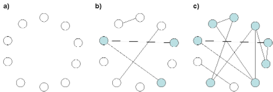
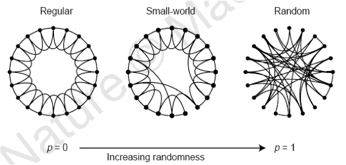
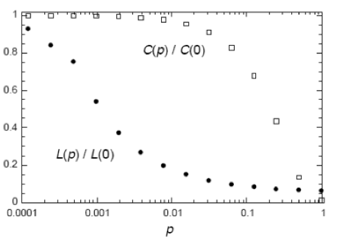
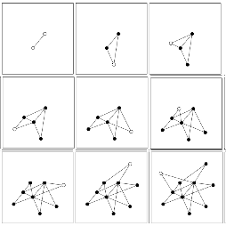
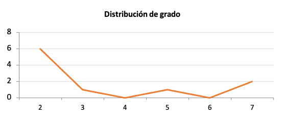
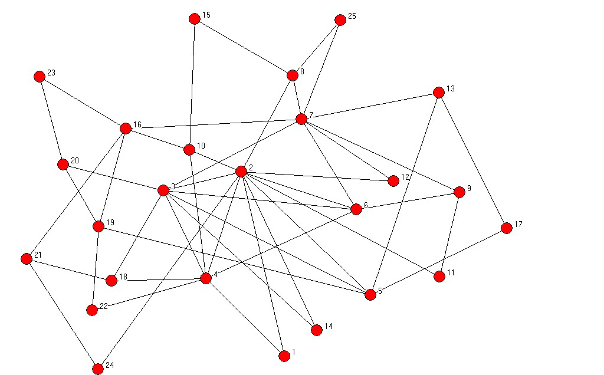
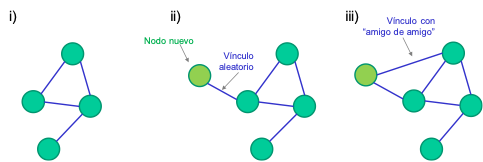
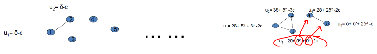
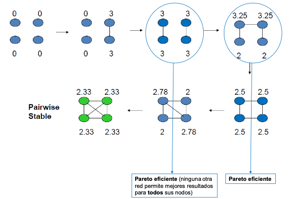

```{r setup, include=FALSE}
knitr::opts_chunk$set(
  echo = TRUE,
  comment = "##",
  collapse = TRUE
  )
```

# Introducción

## ¿Por qué elaboramos modelos de redes?

- Los modelos de red permiten: 
  - Representar de forma sencilla redes complejas del mundo real.
  - Expresar algunas propiedades de las redes a partir de las matemáticas. 
  - Predecir los efectos de las redes: sobre los nodos, sobre el colectivo, sobre aquello que la red pone en circulación (como el conocimiento, las ideas, las enfermedades…)
- Los modelos también sirven como referencia:
  - Dada una red del mundo real, se puede observar en qué grado se asemeja a los modelos planteados.
  - Esto permite concluir en qué medida esa red cumple las propiedades básicas del modelo planteado.

## Algunas consideraciones o aspectos básicos que debemos tener en cuenta para elaborar y analizar modelos de redes:

- Nodos: ¿qué representan? ¿cuáles son sus motivaciones?
- Vínculos: ¿qué miden? ¿cuándo y en qué condiciones se establecen o se eliminan?
- Creación de nuevos vínculos: ¿pueden surgir nuevos vínculos? ¿con qué probabilidad?
- Aparición de nuevos nodos: ¿se trata de una red estática o cambia con el tiempo?
- Desaparición de nodos: ¿los nodos antiguos pueden desaparecer de la red? ¿Qué representa o cómo se interpreta esta desaparición? ¿pueden los nodos desaparecer y, posteriormente, volver a aparecer?
- Características de los nodos: ¿pueden tenerse en cuenta aspectos de los nodos? Dependiendo del tipo de nodo que se considere (por ejemplo, personas, organizaciones o países), los modelos pueden incluir diferentes aspectos que caracterizan a los nodos, tales como su tamaño, edad, forma jurídica o lugar de origen.
- Características de vínculos: ¿podemos considerar el tipo de conexión, la intensidad, la dirección de las relaciones, etc.?
- Costos y beneficios de las redes: por un lado, establecer vínculos puede implicar un costo para los nodos conectados; por otro lado, estas conexiones también pueden generar beneficios para los actores implicados.
- Estrategias: a partir de los incentivos, las motivaciones, la información que disponen los nodos, se puede pensar en estrategias de acción para establecer o eliminar vínculos. Para considerar estos aspectos, la literatura ha combinado avances de la teoría de juegos con el análisis de redes sociales.
- Estructuras grupales: diferentes nodos pueden conectarse formando grupos de distinto tamaño. Por ejemplo, triángulos o cliques de diferentes tamaños, donde todos se vinculan con todos. También pueden surgir estrellas, o grupos donde un nodo canaliza las conexiones o sirve de intermediario entre varios nodos. Algunas redes combinan diferentes tipos de sub-estructuras como éstas, por lo que su inclusión en los modelos resulta de gran utilidad. 
- Efectos de las redes: algunos modelos permiten estimar la influencia que puede ejercer la estructura de la red en distintos aspectos como, por ejemplo, en los rendimientos de los nodos, el resultado colectivo o sobre aquello que la red pone en circulación.

# El modelo de redes aleatorias

- REFERENCIAS: Erdős, P.; Rényi, A. (1959). "On Random Graphs. I.". Publicationes Mathematicae 6: 290–297
  - Información complementaria en el capítulo 3 de Barabasi: <http://networksciencebook.com/chapter/3/#small-worlds>
- Los primeros trabajos acerca de teoría de redes se centraron en grafos regulares, con estructuras ordenadas y relativamente sencillas. 
- Pero las redes del mundo real rara vez muestran estructuras a priori ordenadas. Siguen diversos patrones irregulares. Los vínculos de las redes reales responden a fenómenos tan diferentes que resulta muy difícil encontrar patrones estructurales comunes que sean aplicables de forma general.
- En 1959, Paul Erdős y Alfréd Rényi elaboraron un modelo de red basado en la aleatoriedad de los vínculos. Dada la imposibilidad de encontrar un patrón común presente en las redes del mundo real, los autores optaron por eliminar deliberadamente el supuesto de existencia de un patrón. Para ello, consideraron que las conexiones entre nodos de una red se hacen de forma absolutamente aleatoria.
- Dos supuestos de partida:
  - Los nodos se conectan aleatoriamente.
  - La red no es dirigida, o sea, los vínculos son simétricos.
- Parámetros: 
  - $n$, número de nodos
  - $p$, probabilidad de que dos nodos estén conectados
  - $m$, número de vínculos
- Dinámica:
  1. Se representan todos los nodos.
  2. Para cada vínculo potencial (para cada par de nodos) se decide entre:
    - Representarlo con probabilidad p
    - No representarlo con probabilidad 1-p

## Redes aleatorias y componentes gigantes

- Para toda red aleatoria existe un número de líneas tal que, si nos situamos por debajo de él, predomina la desconexión, mientras que, al superarlo, la estructura cambia drásticamente al aparecer un componente que aglutina a la mayoría de los nodos. Podemos decir, por tanto, que la red se cohesiona a partir de un umbral.
- Algunos cambios en las redes se producen de forma escalonada, hasta un cierto punto, a partir del cual la estructura cambia bruscamente.
- Emergencia de un gran componente en redes aleatorias
  - Empleando un grafo aleatorio de diez nodos se puede observar el proceso por el que emerge un gran componente que aglutina a la mayoría de los nodos de la red:
    - En un primer momento (a), los nodos están completamente desconectados al no existir ninguna línea.
    - Más adelante (b), se crean cuatro vínculos aleatorios y se observa que aparecen tres componentes separados, el mayor de ellos (en gris) formado por tres nodos. Todavía la red está formada por pequeños componentes de nodos desconectados entre ellos.
    - Al ir añadiendo nuevos vínculos aleatorios, llega un momento (c) en el que el número de líneas es igual al número de nodos (diez), lo que hace surgir un gran componente de ocho nodos que aglutina a la mayoría de los nodos de la red (80%).



## Algunas implicaciones de este modelo

- En la medida en que las redes del mundo real presentan cierta aleatoriedad, también responden (en parte) a estas dinámicas.
- Solo cuando hay muy baja probabilidad de conexión, muchos nodos permanecen aislados. No obstante, basta con que la probabilidad de conexión aumente a umbrales pequeños para que apenas queden nodos aislados del resto.
- Los componentes surgen y van aglutinándose progresivamente a medida que va aumentando el grado medio de los nodos. Ninguno de estos componentes conecta a una proporción significativa de los nodos de la red hasta que no se llega al umbral de grado medio = 1. Cuando se llega a ese umbral, entonces emerge un componente gigante (que aglutina a una proporción no trivial de los nodos). 
- Distancia entre nodos: las redes aleatorias presentan una reducida distancia entre sus nodos en promedio.
- Difusión, contagio: la aleatoriedad contribuye a la difusión.

## Distancia entre nodos

- La distancia (d) en una red aleatoria de n nodos, con grado medio de z se puede estimar así:
  - Cada nodo tendrá $z$ nodos a una distancia de $1$, $z^2$ nodos a una distancia de $2$, $…$, $z^d$ nodos situados a una distancia de $d$ líneas. 
  - Dado que $z^d < n$ (nunca puede ser mayor la distancia entre un par de nodos que el número total de nodos del grafo)
  - Cuando $z^{dmax} = n$ ($dmax$ sería la distancia máxima o diámetro del grafo), entonces: 
  - $dmax = \frac{log(n)}{log(z)}$
- Esto permite estimar el diámetro para las redes aleatorias, y ofrece también una buena estimación de la distancia promedio para multitud de redes empíricas (que, no son puramente aleatorias) donde: $d = \frac{log(n)}{log(z)}$
- Es útil dado que permite estimar la distancia entre nodos solamente a partir de dos parámetros ($n$ y $z$) y sin conocer la estructura completa de la red.

# La red de mundo pequeño

- REFERENCIAS: Watts, D. J., & Strogatz, S. H. (1998). Collective dynamics of ‘small-world’networks. nature, 393(6684), 440-442.
  - Información complementaria en el capítulo 3 de Barabasi: <http://networksciencebook.com/chapter/3/#small-worlds>
- Para elaborar su modelo, Watts y Strogatz (1998) partieron de dos premisas: 
  - Las redes sociales del mundo real no son aleatorias, porque gran parte de los contactos vienen condicionados por el entorno.
  - No obstante, algunos de los contactos sí se forman con aleatoriedad. 
- Estas dos premisas se traducen en dos características estructurales de la red:
  - La distancia promedio entre nodos no puede ser muy elevada.
  - Los nodos deben formar grupos altamente conectados entre sí (agrupamientos o clusters).
- La cuestión que surge ahora es: ¿qué estructura de red permite aunar estos dos requisitos? 
- Para medir estas dos propiedades estructurales y, posteriormente, construir y analizar el modelo, los autores proponen emplear dos indicadores:
  1. Longitud de camino (distancia entre nodos)
  2. Coeficiente de agrupamiento
- En la figura se observa el proceso de reordenación de vínculos en una red, desde un retículo periódico hasta una red completamente aleatoria, sin modificar ni el número de nodos ni el de vínculos. 



- Se parte de un retículo periódico o red regular (a la izquierda) formada por 20 nodos y 40 vínculos o líneas dibujados circularmente, donde cada nodo está conectado únicamente con los cuatro nodos más cercanos a él. 
- A continuación, se lleva a cabo el siguiente proceso donde se va introduciendo cierta aleatoriedad: 
  - Primero se elige un nodo cualquiera y la línea que lo conecta a su nodo más cercano en el sentido de las agujas del reloj. 
  - Después se elimina esa línea y, con una probabilidad p, se reconecta con un nodo elegido de forma absolutamente aleatoria. Este proceso se lleva a cabo con el resto de los nodos del retículo siguiendo el sentido de las agujas del reloj. 
  - Una vez reordenados todos esos vínculos, se repite el proceso para la línea que une a cada nodo con su segundo nodo más cercano de forma que, al acabar la segunda vuelta, todos los vínculos han sido reordenados con una probabilidad de aleatoriedad p. 
- En la red regular de la izquierda (sin aleatoriedad, es decir, p = 0) se observa tanto un fuerte agrupamiento de sus nodos como un elevado grado de separación entre nodos. 
- En el otro extremo (la red de la derecha), todos los nodos estarán conectados de forma aleatoria ($p = 1$). Es decir, esta red se corresponde con la red aleatoria del modelo de Erdős y Rényi. En esta red, el agrupamiento es muy reducido y la distancia entre nodos corta. 
- Finalmente, para valores intermedios de p, el grafo resultante es una red de mundo pequeño: fuertemente agrupada, pero con un bajo grado de separación entre sus nodos.
- La razón por la que una red de mundo pequeño mantiene elevados niveles de agrupamiento, junto con bajas longitudes de camino se muestra en este gráfico que analiza la evolución del coeficiente de agrupamiento ($C(p)$) y de la longitud de camino ($L(p)$ en función de la probabilidad de aleatoriedad ($p$). 
- Una vez normalizados ambos valores empleando el valor de $C$ y $L$ en el retículo periódico (es decir, $C(0)$ y $L(0)$ respectivamente), se puede observar cómo a medida que aumenta p el coeficiente de agrupamiento se mantiene relativamente elevado, mientras que la longitud de camino desciende vertiginosamente, dejando así un margen de p para las redes de mundo pequeño. O sea, un margen para grafos de mundo pequeño, con elevado agrupamiento y reducida longitud de camino.



- El modelo es contrastado satisfactoriamente en varias redes del mundo real: 
  - la red de colaboración entre actores de Hollywood
  - la red eléctrica de Estados Unidos 
  - la red neuronal del gusano Caenorhabditis elegans. 
- A pesar de sus diferencias todas estas redes se ajustan bien al modelo.
- Los resultados de Watts y Strogatz sugieren que el fenómeno del mundo pequeño no es una particularidad exclusiva de las redes sociales, sino una característica estructural de multitud de grafos presentes en el mundo real.

# Las redes libres de escala

- REFERENCIAS: Barabási, A. L., & Albert, R. (1999). Emergence of scaling in random networks. science, 286(5439), 509-512.
	- Información complementaria en el capítulo 5 de Barabasi: <http://networksciencebook.com/chapter/5>
- Muchas redes del mundo real tienen algunos nodos que aglutinan un gran número de vínculos.
- Estos hubs, núcleos o conectores no aparecen reflejados, ni en el modelo de redes aleatorias ni en el de redes de mundo pequeño.
- Ante esto Barabasi (2002) plantea tres cuestiones:
	1. ¿Cómo surgen esos hubs?
	2. ¿Cuántos se supone que debe haber en una red dada? 
	3. ¿Por qué los modelos previos no pudieron tenerlos en cuenta? 
- Barabasi y Albert (1999) analizaron la distribución del número de líneas por nodo (distribución de grado) en redes aleatorias y en redes de mundo pequeño.
- Los autores encontraron que, en ambos casos, se puede ajustar a una distribución normal. Es decir, en ambas redes, la mayoría de nodos tienen un grado igual o muy similar al promedio y, a medida que nos alejamos de ese grado medio, los casos son muy difíciles de encontrar, o sea, raramente aparecen nodos con un grado muy superior o muy inferior a la media. 
- Sin embargo, al estudiar la distribución de grado en redes del mundo real, Barabasi y Albert descubrieron que no se ajustaban a una distribución normal, sino que seguían más bien una ley potencial. De acuerdo a esta distribución, la mayoría de los nodos tienen un pequeño número de vínculos, mientras que un reducido grupo de nodos altamente conectados (hubs) aglutinan la mayoría de los lazos de la red. 
- El término “redes libres de escala” se emplea para definir a este tipo de redes como contraposición a lo que sucede en las redes aleatorias y en las redes de mundo pequeño, donde la mayor parte de los nodos tienen un grado muy similar a la media y, por tanto, se puede decir que ambas tienen una escala característica que se identifica con el nodo promedio y que se fija por el pico de la distribución. En cambio, la ausencia de un pico en la distribución de la ley potencial implica que no existe ese nodo característico o nodo típico, por lo que no hay una escala intrínseca en esta red. Es por esto por lo que se conoce a este tipo de redes como redes libres de escala o redes sin escala (Barabasi, 2002).
- Para la elaboración formal del modelo, Barabasi y Albert parten de dos premisas no contempladas en los modelos anteriores: 
	- Primero, consideran que las redes crecen. Es decir, que el número de nodos no es fijo, sino que aumenta con el tiempo. 
	- Segundo, consideran que existe cierta preferencia en el establecimiento de vínculos. Es decir, que no todos los nodos son iguales, algunos atraen más vínculos que otros hacia ellos (“rich get richer”)
- Estos dos supuestos se traducen en dos leyes que rigen la formación de estas redes y permiten crear el algoritmo del modelo: 
	- Ley de crecimiento: para cada periodo de tiempo se añade un nuevo nodo a la red. 
	- Ley de enlace preferencial: asumiendo que cada nuevo nodo se conecta con los ya existentes, la probabilidad de que éste elija un nodo en concreto es proporcional al grado del nodo elegido

## Formación de la red

- Los nodos nacen en distintos momentos $i \in {0,1,2…,t,…}$ con un número $m$ de vínculos.
- La probabilidad de que un nodo $i$ reciba un link de un nodo nuevo en el momento $t$ es $m$ veces el número de links de $i$ (su grado) en relación con la suma de los grados de todos los nodos de la red en $t$: $m = \dfrac{d_i(t)}{\displaystyle\sum^t_{j=1}d_j(t)}$
- Dado que, en total, la red tiene $tm$ vínculos en el momento $t$, entonces: $\displaystyle\sum^t_{j=1}d_j(t)=2tm$
- Por tanto, la probabilidad de que un nodo $i$ reciba un nuevo link en $t$ es: $\dfrac{d_i(t)}{2t}$

## Sobre el la vinculación preferencial o enlace preferencial

- Aunque el término preferential attachment fue acuñado por Barabasi y Albert (1999), el fenómeno que representa se ha estudiado en diversos ámbitos. Refleja lo que se conoce como “efecto Mateo”. Al que más tiene, más se le dará, y al que menos tiene, se le quitará para dárselo al que más tiene. Mt, cap. 25, vers. 14-3
- Algunos ámbitos en los que este efecto ha sido estudiado son los siguientes:
  - En matemáticas, para explicar la naturaleza de ciertas distribuciones (Polya, 1923)
  - En biología, para analizar la distribución del número de especies por cada género biológico en plantas con flores (Yule, 1925)
  - En economía, para describir la distribución de la riqueza (Zipf, 1941)
  - Además, el economista Herbert Simon empleó este concepto para explicar estadísticas distribución de ciudades según su tamaño, frecuencia de palabras en un texto o el número de artículos publicados por científicos (Simon, 1955).
- Desde el análisis de redes, también se puede comprender este fenómeno. En particular, la vinculación preferencial sirve para explicar los siguientes tipos de redes:
  - Redes sociales: cuantos más contactos tenga una persona, más probabilidad tendrá de ser presentada –por sus actuales contactos- a otros individuos. En otras palabras, sin amigos es difícil hacer nuevos amigos.
  - Redes de citaciones: ningún científico es capaz de conocer todos los artículos publicados sobre un tema. Si asumimos que los investigadores citan a otros autores que aparecen en los artículos que leen, entonces los autores con más citas serán más citados.
  - Red de aeropuertos: los nuevos aeropuertos (o nuevas compañías aéreas) tenderán a conectarse con los principales aeropuertos para no quedar aislados de la mayor parte del tráfico aéreo.
- Evolución de una red libre de escala de aumenta su tamaño de 2 a 10 nodos.
  - En el siguiente gráfico se representa la evolución de una red que se rige de acuerdo a los dos supuestos de partida del modelo de Barabasi y Albert, es decir, una red a la que se van incorporando nodos nuevos y en la que los links se establecen siguiendo un criterio de enlace preferencial.
  - Los nodos en blanco son los que surgen nuevos en cada momento, mientras que los pintados en negro son los que ya estaban en los momentos anteriores.
  - Cada nodo nuevo se conecta con el resto empleando dos vínculos ($m = 2$).



- Al observar la red que surge después de este proceso (cuadro de abajo a la derecha), podemos plantearnos lo siguiente: ¿cómo es la distribución de grado resultante? ¿Cuáles son los nodos con más vínculos? ¿cuáles son los que tienen menos vínculos? El gráfico siguiente nos ilustra frente a estas cuestiones.



- Veamos otro ejemplo, una red libre de escala formada por 25 nodos.
  - El número corresponde al momento en que aparece el nodo.
  - Los nodos que aparecen más tarde, tienen un grado menor y viceversa.



## Conclusiones

- El modelo de Barabasi y Albert permite representar dos aspectos clave de las redes del mundo real: el crecimiento y la vinculación preferencial. Además, el modelo contempla la existencia de hubs.
- Varias redes del mundo real se ajustan bien al modelo. De hecho, lo hacen mejor que al modelo de redes de mundo pequeño. Por ejemplo: la red física de Internet, la estructura de enlace virtual de la World Wide Web o las redes metabólicas de algunos organismos
- Sin embargo, el modelo no contempla todavía algunos aspectos fundamentales de las redes reales como, por ejemplo, la desaparición de algunos nodos, la creación de vínculos entre nodos antiguos o las características distintivas de algunos nodos.

# Redes estratégicas y otros modelos de red

## El modelo híbrido de Jackson y Rogers (2007)

- REFERENCIAS: Jackson, M.O., Rogers, B.W. (2007). Meeting strangers and friends of friends: How random are social networks? American Economic Review 97(3), 890-915.
  - Jackson, M. O., Wolinsky, A. (1996). A strategic model of social and economic networks. Journal of Economic Theory, 71(1), 44-74.
  - Más información en Jackson (2008). Social and Economic Networks, Princeton University Press, Princeton.
- En este modelo, los autores introducen variaciones sobre la base de los modelos de redes aleatorias y redes sin escala. 
- En particular, el modelo parte de una red en la que van apareciendo nuevos nodos a medida va pasando el tiempo. Cada nuevo nodo que pasa a formar parte de la red establece sus vínculos a partir de dos procesos o criterios de conexión diferentes:
  - Algunos de sus vínculos son aleatorios.
  - Otros vínculos los establece siguiendo un proceso de vinculación preferencial (por ejemplo, se conecta con “amigos de sus amigos”).
- Dinámica del modelo híbrido: en el siguiente gráfico se representa un ejemplo sobre la evolución, en tres pasos, de un modelo de este tipo:



  1.	En i vemos la red con una estructura inicial.
  2.	En el momento siguiente (ii) surge un nodo nuevo que establece un primer vínculo de forma aleatoria.
  3.	Posteriormente (iii), este nodo genera otro vínculo que depende de su contacto previo. 
- La distribución de grados resultante de este proceso se encuentra en un punto intermedio entre las distribuciones de las redes aleatorias y las de las redes libres de escala.

## Modelos de formación estratégica de redes (redes y juegos)

- Los modelos de formación estratégica de redes buscan alcanzar dos grandes objetivos:
  - Primero, considerar que las redes tienen implícitos costos y beneficios para los actores. Establecer un vínculo supone un costo, pero también puede reportar ventajas. Esto tiene importantes implicaciones tanto individuales (para los nodos) como colectivas (para el conjunto de la red).
    - Este aspecto es fundamental porque permite identificar no sólo cómo serán (qué estructuras presentarán) las redes, sino también qué redes son más estables y cuáles son socialmente más deseables.
  - Segundo, estos modelos buscan predecir cómo los incentivos individuales se trasladan a estructuras colectivas de red (y viceversa).
- Jackson (2008) apunta algunas consideraciones relevantes que nos ayudan a comprender los modelos de formación estratégica de redes.
  - Si bien los individuos no necesariamente tienen comportamientos maquiavélicos, sí tienden a establecer relaciones que son mutuamente beneficiosas y a romper relaciones que no lo son.
  - La dinámica detrás de estos incentivos puede incidir significativamente en el comportamiento de las personas. 
  - A menudo esta dinámica opera sin que los individuos sean conscientes de ella.
- Modelo básico de redes estratégicas: Jackson, M. O., y Wolinsky, A. (1996). A strategic model of social and economic networks. Journal of Economic Theory, 71(1), 44-74.
  - Se puede emplear para analizar la formación de una red no dirigida.
  - Elementos básicos:
    - $u_i(g)$: utilidad del nodo $i$ (por estar conectado al grafo $g$)
    - $0 \leq \delta \leq 1$: beneficio que obtiene $i$ por conectarse con el nodo $j$
    - $0 \leq c_{ij}$: costo en que incurre $i$ por conectarse con $j$



  - En resumen:
	  - Dada una red $g$, la utilidad neta $u_i(g)$ que recibe el actor $i$ por ser parte de la red es la suma de los beneficios que obtiene de todos sus contactos (directos e indirectos) menos los costos de mantener sus vínculos: $u_i(g) = \displaystyle\sum_{j \neq i} \delta^{l_{ij}(g)}-d_i(g)c$
	  - Donde:
	    - $l_{ij}(g)$ es el número de links en la geodésica entre $i$ y $j$
	    - $d_i(g)$ es el número de links que tiene $i$ (su grado sin normalizar)
	    - $c>0$ es el costo de mantener un link
- Redes eficientes
	- El modelo básico de Jackson y Wolinsky permite analizar la eficiencia de las redes desde el punto de vista colectivo.
	- Se puede considerar que una red $g$ es eficiente cuando maximiza la utilidad de sus nodos: $\displaystyle\sum_i u_i(g) \geq \displaystyle\sum_i u_i(g') \ \forall g' \in G(N)$
	- Si el costo $c$ es bajo, resultará eficiente incluir más links en la red.
	- Si, por el contrario, el costo $c$ es elevado en relación con el beneficio que genera, entonces las redes con menos links serán más eficientes.
	- Para comprender el proceso de creación y eliminación de vínculos (y los incentivos que hay detrás de este proceso) conviene revisar el concepto de estabilidad por pares (*pairwise stability*) introducido por Jackson y Wolinsky. 
	- El concepto de estabilidad por pares o pairwise stability se basa en tres ideas:
  	- Primero. Los vínculos pueden proporcionar tanto costos como beneficios.
  	- Segundo. Para establecer un nuevo vínculo se necesita el acuerdo de dos nodos.
  	- Tercero. Para eliminar un vínculo existente, basta con que uno de los dos nodos conectados quiera borrarlo.
	- Sobre la base de estas ideas, se puede concluir que una red g es estable por pares (*pairwise stable*) si se cumplen, simultáneamente, las siguientes dos condiciones:
	  1. Ningún nodo mejoraría su utilidad si eliminase un vínculo del que forma parte: $u_i(g) \geq u_i(g-ij)$ para todo vínculo $ij \in g$
	  2. Ningún par de nodos desconectados mejoraría si se estableciese un vínculo nuevo entre ellos (estrictamente, al menos uno de los dos nodos):
      - Si $u_i(g+ij) > u_i(g) \Rightarrow u_j(g+ij) < u_j(g)$ para todo vínculo $ij$ no perteneciente a $g$



- Se pueden identificar dos grandes contribuciones de este tipo de modelos:
  - Por un lado, permiten observar el bienestar social que generan las redes y compararlo con el beneficio individual que obtiene cada actor.
  - Por otro lado, sirven para explicar cómo las redes forman determinadas estructuras (igual que los modelos anteriores) y para entender por qué llegan a esa estructura.
  - Ejemplos de este segundo punto son los siguientes: 
    - Niveles elevados de agrupamiento se asocian con bajos costos de los vínculos entre aquellos actores que se encuentran cercanos en distancias sociales o geográficas.
    - Reducidas distancias entre nodos se asocian a elevados beneficios potenciales que reportan las conexiones con nodos distantes en términos sociales o geográficos.
- En conclusión, estos modelos nos ayudan a plantear preguntas de investigación distintas a las que podíamos afrontar con los modelos anteriores (como el de redes aleatorias, redes de mundo pequeño o redes sin escala). En particular, los modelos de formación estratégica de redes nos ayudan a resolver cuestiones como, por ejemplo:
  - ¿Qué redes son más estables? 
  - ¿Qué niveles de ineficiencia tienen las redes ineficientes?
  - ¿Qué tipo de intervenciones pueden mejorar la eficiencia de las redes?
  - ¿Son equitativas las redes? ¿Qué niveles de desigualdad presentan?
  - ¿Pueden algunas intervenciones mejorar la desigualdad en las redes?

## Modelos ERG (Exponential Random Graph Models)

- REFERENCIAS: Robins, G., Pattison, P., Kalish, Y., & Lusher, D. (2007). An introduction to exponential random graph (p*) models for social networks. Social networks, 29(2), 173-191.
  - Más información en Jackson (2008). Social and Economic Networks, Princeton University Press, Princeton.
- Este tipo de modelos ha tenido un gran desarrollo en las últimas décadas desde diferentes campos de la literatura de redes. Hay diversas razones por las que los modelos estocásticos son una buena herramienta para analizar redes. Resumimos aquí algunas.
  - Permiten tener en cuenta la complejidad de las interacciones sociales, capturando los patrones de comportamiento que generan las redes, pero considerando también que hay cierta incertidumbre que no se podrá modelizar.
  - Permiten inferir qué subestructuras de red están más presentes de lo esperado en una red aleatoria y plantear hipótesis sobre los procesos sociales que pueden generar esas subestructuras. Por ello, son especialmente útiles en redes con estructuras complejas.
  - Contribuyen a comprender mejor los procesos por los que los comportamientos a nivel micro (de los nodos) se trasladan a la macroestructura de la red.
- La lógica detrás de los ERGM es, esencialmente, la siguiente:
  - Se considera que los vínculos se establecen en un proceso estocástico con un número fijo de nodos.
  - La aparición o desaparición de vínculos está determinada por algunos procesos sociales.
  - Se seleccionan estructuras de red, que representan los procesos sociales generadores de la red, y se les asigna un parámetro para medir cada una de estas subestructuras.
  - Estas subestructuras permiten contemplar diversos aspectos, desde características de los nodos o los vínculos entre tipos de actores hasta diversas formas de conexión complejas, como la formación de triángulos, grupos cohesivos más amplios, estrellas, etc.
  - El modelo representará la distribución de redes del mismo tamaño que surgen de forma aleatoria considerado y las subestructuras elegidas.
  - El objetivo del modelo será identificar las subestructuras que maximizan la probabilidad de que emerja una red muy similar a la red dada.
- Forma general de los modelos ERG:
  - $P(X=x)=\left(\frac{1}{k}\right)exp\left(\displaystyle\sum_A \beta_A g_A(x)\right)$
  - Donde:
    - $P(X=x)$: probabilidad de que la red $X$, generada a partir de las características seleccionadas, sea idéntica a la red $x$, observada en los datos.
	  - $k$ es una constante de normalización que garantiza que la ecuación es una distribución de probabilidad adecuada.
	  - $g_A(x)$: características o propiedades de red (nivel de nodos, díadas o estructura de red) 
	  - $\beta_A$: parámetro correspondiente a la característica $g_A(x)$

# Notas y Bibliografía